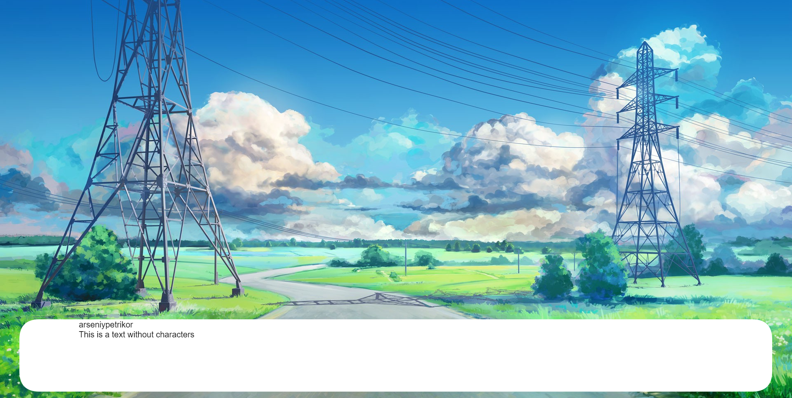
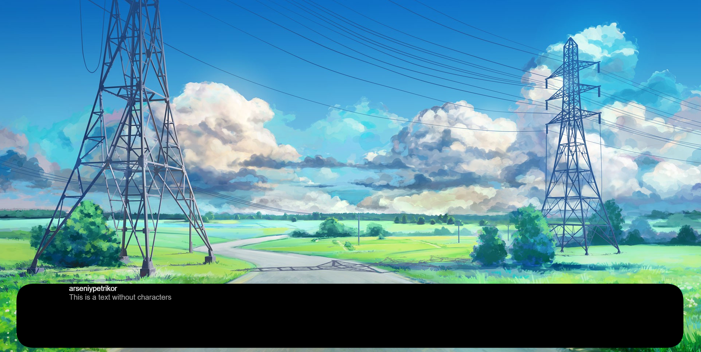
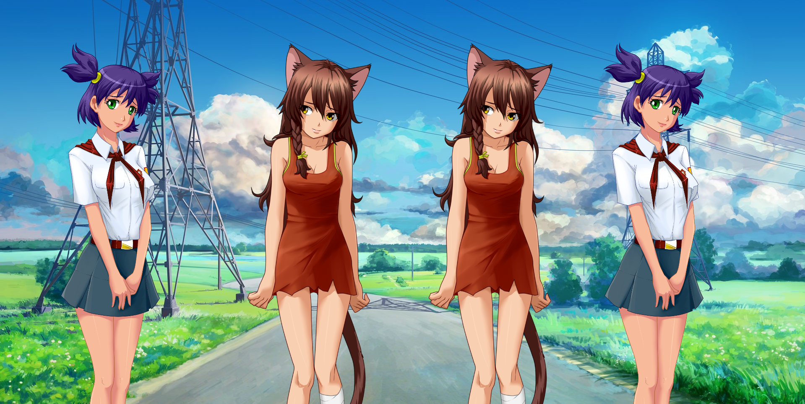
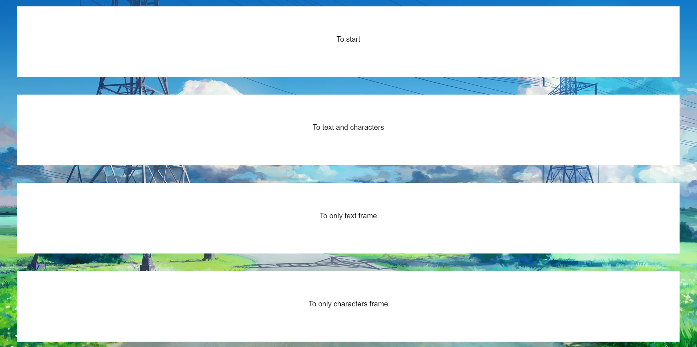
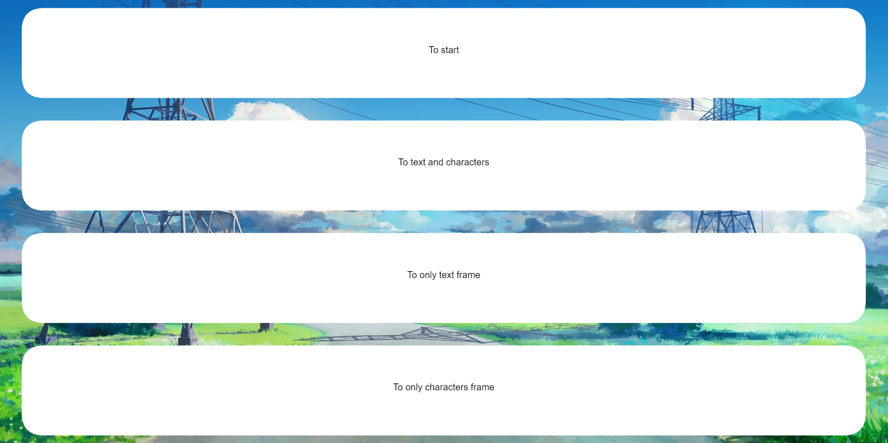

# Nauper
Nauper is a engine for visual novels based on web technologies.

Nauper uses HTML5 `<canvas>` element for rendering and controlling it by JS.

## Code guide
We use ES5 syntax with some ES6 features.

JavaScript style guide: [Airbnb](https://github.com/airbnb/javascript/tree/master)

ES6 translates to ES5 using Babel

## Engine structure
Okay, if you're there, I think you want to know about engine structure.

That's this:
* **Character**, functionality:
  * Giving object with links to images with characters sprites
* **UI**, functionality:
  * Background drawing
  * Textboxes drawing
  * Text drawing
* **Frame**, functionality:
  * Drawing characters on canvas
* **Question**, functionality:
  * Giving a choices to user, maximum is 4, they're redirecting user between scenes
* **Engine**, functionality:
  * Starting **Frame**'s and **Question**'s drawing
  * Handling clicks on canvas
  * Handling choices of **Question**

So, if you opened /src directory, you saw two more files.

That's what they are:
* **utils.js**, functions:
  * wrapText - function, needed by **UI**
  * getTextOffset - function, needed by **UI** too
  * putDefaults - function that expands given object with default object
* **nauper.js**, functionality:
  * In that file we can only see **Nauper** object definition

## Nauper's functionality
You can draw background (oh, really?)

You can draw textboxes with text

Textboxes can be rounded

You can also change color of text

You can draw characters

You can also draw characters and text at the same time

You can create questions with maximum of four choices

Question's textboxes can also be rounded

And I think you understand that you can also change color of question's text, so I didn't put picture of this

## How to use
Coming soon!

## TODO
For help:
* *Realizeable* - functions that we can create in a short period of time
* *Unrealzeable* - we need to think and code very much to get this functions done

Realizeable:
* *Fix* name and text positioning
* *Fix* characters display on mobile devices
* *Create* unnecessary choices in addition to unnecessary Questions
* *Add* default configs to all types
* *Add* 'active' state of **Question**'s choice
* *Add* text color changing to **Question**

Unrealizeable:
* *Fix* text positioning on mobile devices in album orientation
* *Add* opportunity to put images as a textboxes
* Increase performance
